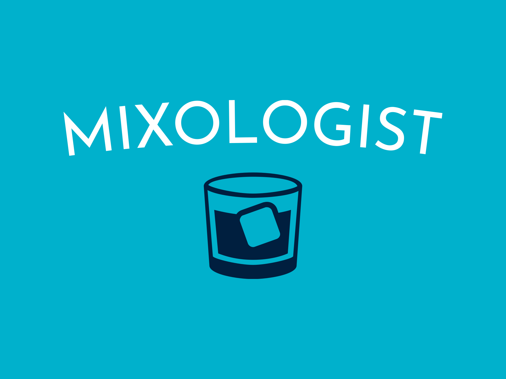

# Mixologist

Dobrodošli v svetu Mixologist - mobilne aplikacije, ki vam odpira vrata do izjemnega sveta napitkov! S ponosom vam predstavljamo inovativen in enostaven način za raziskovanje, ustvarjanje in uživanje v najboljših napitkih, kjerkoli že ste.

Mixologist je vaš osebni vodnik skozi pestro paleto izvrstnih in osvežujočih napitkov. Ne glede na to, ali ste strastni ljubitelj koktajlov, ljubitelj osvežilnih sadnih napitkov ali pa preprosto želite razširiti svoje znanje o pijačah, je Mixologist pravi sopotnik za vas.



## Features

- Iskanje napitkov
- Iskanje napitkov po kategoriji
- Reprezentacija napitka, sestavin napitka in priprave napitka
- Dodajanje napitkov med priljubljene

## Kazalo vsebine

- [Namestitev](#installation)
- [Uporaba](#usage)
- [Sodelovanje](#contributing)

## Namestitev

1. Kloniraj repozitorij:

   ```sh
   git clone https://github.com/mihahorvat5/Mixologist.git
   ```

2. Namesti odvisnosti:

- cd .\react-app\
- yarn install --global
- yarn global upgrade expo-cli
- yarn global add expo-cli@4.18.4 (izberi najnovejšo verzijo)
- yarn expo upgrade 47.0.0

## Uporaba

1. Zaženi VSCode (ali drugo razvijalno okolje):

- cd .\react-app\
- npx expo start --tunnel

2. Poskeniraj QR kodo (za Android moraš imeti aplikacijo Expo Go).

3. Če imaš zagnan simulator: Za IOS pritisni tipko "i" in se bo aplikacija zagnala v simulatorju

## Sodelovanje

Prispevanja so dobrodošla! Če želiš prispevati k Mixologist, sledi tem korakom:

1. Forkaj projektov repozitorij.
2. Ustvari nov branch za svojo funkcionalnost ali popravilo napake.
3. Implementiraj svojo funkcionalnost ali naredi potrebne popravke napak.
4. Commitaj in potisni spremembe.
5. Predloži zahtevek za poteg v glavno vejo (pull request).

Prosimo, upoštevaj Pravila obnašanja pri sodelovanju.